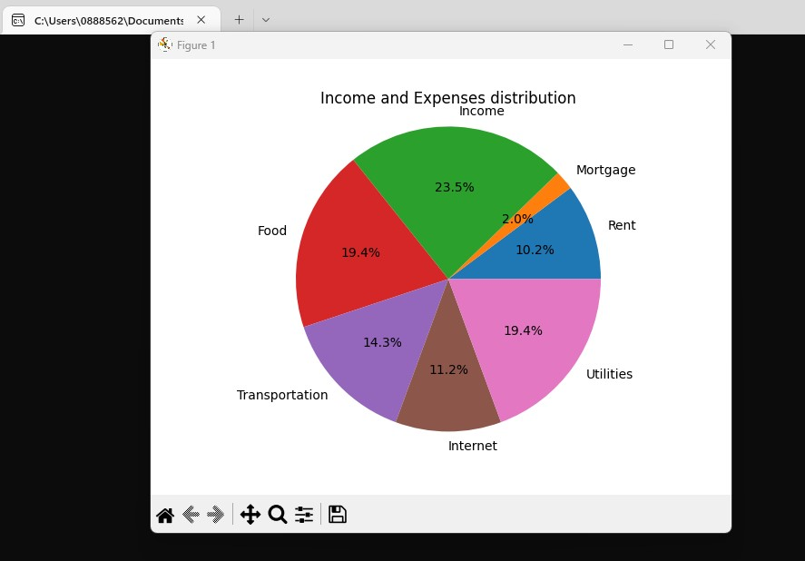

# Personal Budget Python Application

## Getting Started
This is a terminal based Python app that allows users to project and track their personal budget.

Key features include:

1. Estimate your projected budget for a month and year's time period
2. Record and track your income and expenses (this will be stored inside a csv file)
3. See a visual graph showing the distribution of your income and expenses by category

Below are some screenshots of the terminal Python app:




## Requirements
- Python 3.11.1 or higher
- Have Git installed on your system. You can download Git from the official Git website (https://git-scm.com/)
- Have a Bash shell installed on your system. This should already be included by default on most Linux and macOS ststems. Windows users can install a third-party application such as Git Bash.
- Windows 11 version 22H2 or higher (only for users who want to run the app using the .exe file)

There is also a requirements.txt file that displays the versions of imported python packages used for this application. These packages will automatically be installed by running the Bash script file 'run_app.sh' upon following the installation steps listed below.


## Installation

Follow the steps below to run the app.

You will need to open a terminal or command prompt in order to run the commands below. 

GitHub repository link - https://github.com/tonylehuynh/Terminal-App-Assignment


1. Clone the repository from Gitub:

```
git clone https://github.com/tonylehuynh/Terminal-App-Assignment.git
```

2. Navigate to the project directory:

```
cd Terminal-App-Assignment
```
3. Run the 'run_app.sh' file:
```
bash run_app.sh
```

### _.exe installation_

Alternatively, if you are a Windows user (Windows 11 version 22H2 or higher), you can also navigate to the 'dist' folder and then to the 'app' folder. In the 
'app' folder, you can find and run the file 'app.exe'.

Please note that you will need to have already installed the imported python packages listed in the requirements.txt file in order to run 'app.exe'.

To install the packages listed in the requirements.txt file, you can use the pip command:

```
pip install -r requirements.txt
```
You can also find instructions on how to install python packages here - https://packaging.python.org/en/latest/tutorials/installing-packages/

Folder path here:
```
.\Terminal-App-Assignment\dist\app
```
Run the 'app.exe' file in this folder


## Instructions

Once you have successfully run the python app, simply input the required input or details that are prompted before hitting the enter key.

You can see this in the screenshot below where the app will prompt you to enter in a date (YYYY-MM-DD) and income $ amount to record. 


**Please also note** that all recorded income and expenses that you provide are stored in a created 'data.csv' file. You can open this csv file separately to view it's contents. Please be mindful on security if any sensitive information is stored in this 'data.csv' file. 

## Style Guide

The code for this Python app adheres to the PEP 8 styling guidelines.

## References used

(1) [PEP 8 Style Guide](https://peps.python.org/pep-0008/)

(2) [csv package documentation](https://docs.python.org/3/library/csv.html)

(3) [os package documentation](https://docs.python.org/3/library/os.html)

(4) [pandas package documentation](https://pandas.pydata.org/docs/)

(5) [matplotlib package documentation](https://matplotlib.org/)

(6) [datetime package documentation](https://docs.python.org/3/library/datetime.html)

(7) [pytest package documentation](https://docs.pytest.org/en/7.2.x/contents.html)


## Features development

Here are the main features that are included in this application:

1. Menu
2. Budget projection
3. Record income and expenses and store in a csv file
4. Generate visual graph (piechart) on income and expense data by category
5. See last 10 recorded entries within the app

Description of features:

### **1. Menu**

This feature allows the user to choose an option of what they wish to do when opening the app.


The screenshot above shows how the user can enter the options '1', '2' or '3' to choose.

The menu feature utilises while loops and try except blocks in order to handle any invalid inputs that the user may provide. 

A second menu can also be shown in this screenshot:


### __2. Budget projection__

This feature allows the user to receive an estimated budget projection for a month and year's time period.

User will input estimated monthly income and monthly expenses in order to do this.

This would be used for users who wish to see a quick estimation on what their budget may look like for the year for planning purposes.


### __3. Record income and expenses__

User will utilise this feature to track their actual income and expenses. These entries will be stored in a 'data.csv' file. 

Expenses will also be separated and recorded by category.


### __4. Generate pie chart__

This feature will read the stored entries recorded in the 'data.csv' file and then generate a pie chart.

This pie chart will display a distribution of the user's income and expenses by category.


Python packages will be used to create the pie chart. 

### __5. See last 10 entries__

This feature will allow the user to quickly see their last 10 recorded income and expense entries from within the app, as opposed to having to open the 'data.csv' file separately themselves.


## Implementation plan

Trello was a project platform that was used to track and develop the implementation plan. 

Here is the link to the Trello board - https://trello.com/invite/b/Xi5NY8w2/ATTIea889a025741ac59ec3781a81a4b666e0C9ADCCD/terminal-assignment

I utilised Trello to record notes to help develop the implentation plan of this app. I made a checklist of items to complete for each task required for the app, while also recording any ideas I had in the initial ideating stage. 

Trello was also used to set deadlines for the completion of tasks.

Screenshot below is the Trello board during the initial stage of the app:


Below is the Trello board in the middle of working on the app with some tasks completed:


In the Initial Project Discussion section of the Trello board, I wrote down all my ideas for the app. After consulting with the educators, I narrowed down my app idea as an MVP and initially had 3 main features which were the main menu, the estimated budget projection and recording income & expenses. 

The 2 additional features of generating a pie chart and displaying the last 10 entries were included in the 'Non MVP additional ideas' card. I implented these 2 features once the first 3 main features were completed as priority. 

The first priority of the app was the initial project set up card. Here I outlined the need to research python packages and how to install the ones that would assist me with my application. Part of the initial project set up was also setting up the virtual environment. 

3 key features of the app were then in my To Do list. The order of priority was based on the control flow of the app, where the main menu feature was highest priority as it was the first thing that the user would see when loading the app. 

The second priority and feature was the budget estimated projection. This was chosen as it was the feature I was most confident in completing, and that I would be able to reuse any code as well as any learnings on any features that I would next implement. 

The prioritisation, implementation, deadlines and durations for each feature and checklist item are listed in the cards of the Trelloboard. 

The checklist items as well as comments sections for each card helped me outlined the tasks that would need to be completed for each feature of the application. 

I also included other tasks of the assignment outside of coding on the Trello Board as well, such as completing the slide deck, the read me file etc. 

Here are some screenshots for the Trello cards containing the app features as well as checklist items to be completed. The screenshots outline how I intended on implementing each feature and the deadlines I gave myself:


## TESTING

**Unit tests** which utilised the 'pytest' python package were used throughout the development of the app.

Each main feature of the app contains functions which were key to ensuring the feature ran as intended. During the development of each of these functions, unit testing was utilised to ensure that the functions worked and outputted the correct information, which in turn ensured that the app features were working as intended.

Comments in the test files such as 'test_budget_projection.py' and 'test_income_tracker.py' explain what each test and test case was testing.

**Manual testing** was also utilised in order to test the features of the app.

This was recorded in an spreadsheet with a description of the specific functionality of the feature being tested and what was the expected result. 

__Test 1 - Main Menu__

The first manual test I did was the testing of the menu features in the application. This is where user will see a list of options for specific actions, and they will input a number in order for that option to run.

This is recorded in an Excel spreadsheet called "Main_Menu_Test.xlsx" (located in docs folder of the assignment deliverables). I conducted various tests of different inputs to ensure that the correct options be executed and that user invalid inputs would be accounted for and the user could try again if they entered an invalid input.

The manual testing here was done to ensure that the while loops used in the functions were working as intended, as well as ending when the user entered a valid input as opposed to having the error of an infinite loop. 

The try except blocks used in the functions were also tested to ensure that they were catching invalid user inputs. 

See this in screenshot below:


__Test 2 - Record Income & Expense__

This second manual test I did was was the testing of the 'record income and expense' feature in the application. This is where the user will be able to first choose if they are recording an income or expense. They can then enter the date the transaction took place as well as the $ amount. If the user is recording an expense, they can also select what category of expense it is.


In order to access the 'record income' feature, the user will first need to open the app, enter '2' to see the tracker menu and then enter '1' to record income. 

In order to access the 'record expense' feature, user will first need to open the app, enter '2' to see the tracker menu and then enter '2' again to record expense.

This second manual test was recorded in an Excel spreadsheet called 'Record_Income_Expense_Test.xlsx' (located in docs folder of the assignment deliverables)

There were various tests conducted to cover for any incorrect user inputs for date and income/expense amount.

The tests also checked to make sure that a data.csv file was created to store the entry, if there wasn't a data.csv file available. This was to ensure that the if statements, os path and write to csv functions were working as intended.

Lastly, tests were done to ensure that the user inputs were appended and recorded to the data.csv file with the correct information.

See screenshot below:


Overall, the manual testing of the two main features of "Menus" and "Recording Income/Expense to csv file" were very relevant in ensuring that these features were working as intended for this application. Each test case was also to ensure that the application didn't break due to invalid user input. 


